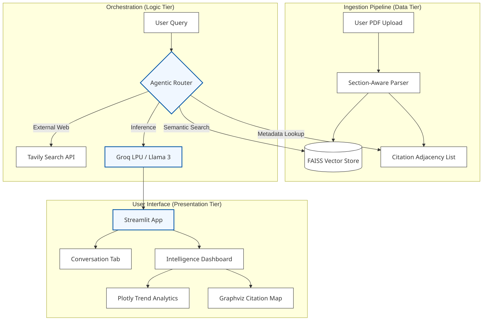

# 🧠 Research Intelligence Assistant

### An AI-powered research platform designed to transform static PDFs into interactive, visual intelligence dashboards. Built with LangChain, Groq (LPU Inference), and Streamlit, this tool automates citation mapping, trend analysis, and cross-paper synthesis.

## 🚀 Features

* **Groq-Powered Inference:** Lightning-fast response times using Groq’s LPU technology.

* **Multimodal Ingestion:** Automated PDF parsing with section-aware chunking.

* **Intelligence Dashboard: * Citation Graphs:** Interactive node-edge visualizations using Graphviz.

* **Trend Analytics:** Publication tracking and keyword frequency via Plotly.

* **Dual-Context RAG:** Switch between local library knowledge and live web search.

## 🏗️ System Architecture

The following diagram illustrates the flow from document ingestion to the user's intelligence dashboard.



**Architecture Flow:**

1. **Ingestion Layer:** PDF data is parsed into a structured ResearchPaper model. Text is converted into embeddings using HuggingFace models.

2. **Storage Layer:** Embeddings are stored in FAISS for retrieval, while metadata/citations are stored in an Adjacency List for graph rendering.

3. **Orchestration Layer:** A LangChain Agent acts as the brain, deciding whether to pull data from the local vector store, the citation graph, or the external Tavily Web Search.

4. **Inference Layer:** Groq processes the prompt and context to generate a finalized synthesis.

5. **UI Layer:** Streamlit renders the chat and the Intelligence Dashboard tabs.

## 🛠️ Tech Stack

* **LLM:** Llama 3 (via **Groq**)

* **Orchestration:** LangChain

* **Vector Store:** FAISS

* **Embeddings:** HuggingFace (all-MiniLM-L6-v2)

* **Frontend:** Streamlit

* **Search API:** Tavily

## 📦 Installation & Setup
**1. Prerequisites**

   Ensure you have Graphviz installed on your system:

  * **macOS:** brew install graphviz

  * **Linux:** sudo apt-get install graphviz

**2. Clone and Install**

```
git clone https://github.com/your-username/research-intelligence-assistant.git
cd research-intelligence-assistant
pip install -r requirements.txt
```
**3. Environment Variables**

Create a .env file:

```
GROQ_API_KEY=your_groq_api_key
TAVILY_API_KEY=your_tavily_api_key
```
**4. Run the App**

```
streamlit run app.py
```

## 📊 Design Rationale

* **Groq LPU:** We use Groq to minimize the "time-to-first-token," ensuring that complex cross-paper comparisons feel instantaneous.

* **Minimalist Dashboard:** The UI focuses on high data-ink ratios—using thin lines and neutral colors in Graphviz and Plotly to maintain professional clarity.

* **Adjacency List:** Chosen for simplicity; allows for $O(1)$ lookup of citation neighbors without the overhead of a dedicated graph DB.
